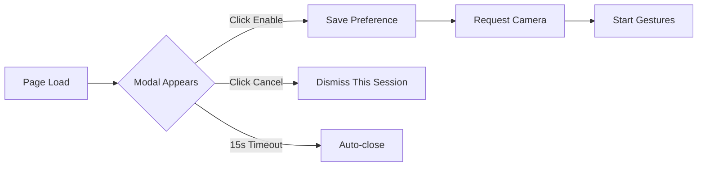
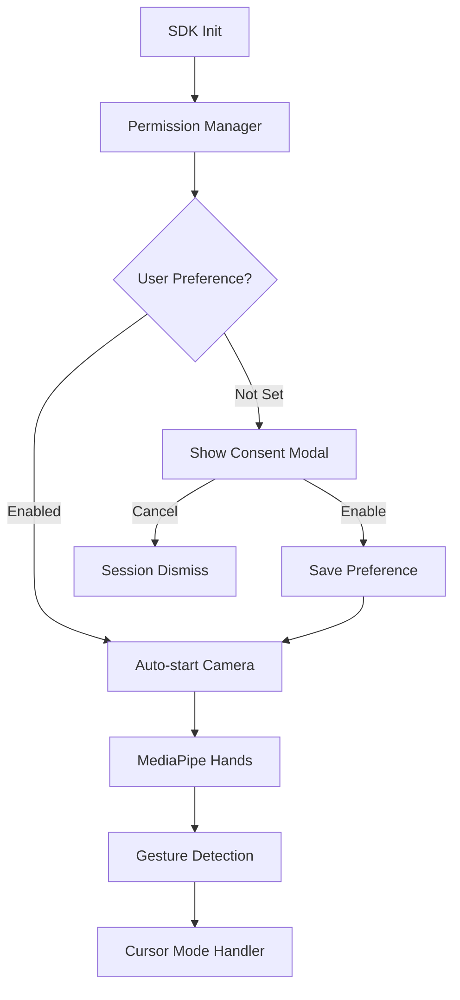

# Gesture Accessibility SDK

> **Hand gesture-based web accessibility for everyone**

[](https://github.com/jashwanth-cse/gesture-accessibility-sdk)
[](LICENSE)

## Overview

The Gesture Accessibility SDK enables hands-free web navigation using hand gestures captured via webcam. Built with MediaPipe Hands for real-time tracking and designed for users with mobility impairments.

### ✨ New in v0.2.0

- 🔒 **Consent Modal System** - Never requests camera permission on page load
- 💾 **Preference Persistence** - Remembers user choices via localStorage
- ⏱️ **Auto-dismiss Modal** - 15-second timeout for non-intrusive UX
- 🛡️ **Graceful Error Handling** - Never retries after permission denial
- 🔄 **SPA & MPA Compatible** - Works seamlessly across navigation patterns

## Features

- ✋ **Real-time Hand Gesture Recognition** - Detects pinch, fist, open palm, and finger combinations
- 🖱️ **Virtual Cursor Mode** - Joystick-style cursor control with click and scroll
- ⚙️ **Dynamic Configuration** - Backend-driven settings with built-in fallbacks
- 🔒 **API Key Authentication** - Secure communication with configuration server
- 🎯 **Zero Dependencies** - Pure JavaScript with CDN-loaded MediaPipe
- 📦 **Lightweight** - ~19KB minified

## Quick Start

### Installation

#### Option 1: CDN (Recommended)
```html
<script src="https://cdn.jsdelivr.net/gh/jashwanth-cse/gesture-accessibility-sdk@v0.2.0/dist/gesture-accessibility.min.js"></script>
```

#### Option 2: NPM (Coming Soon)
```bash
npm install gesture-accessibility-sdk
```

#### Option 3: Local
Download `dist/gesture-accessibility.min.js` and include in your project.

### Basic Usage

```html
<!DOCTYPE html>
<html>
<head>
  <title>My Accessible Site</title>
</head>
<body>
  <h1>Welcome</h1>
  
  <!-- Load SDK -->
  <script src="path/to/gesture-accessibility.min.js"></script>
  
  <!-- Initialize -->
  <script>
    GestureAccessibility.init({
      apiUrl: "https://your-backend.com",
      siteId: "your-site-id",
      apiKey: "your-api-key",
      debug: true  // Enable console logs
    });
  </script>
</body>
</html>
```

That's it! The SDK will:
1. Show a consent modal to the user
2. Request camera permission only after user approval
3. Remember the user's preference
4. Start gesture detection automatically on subsequent visits

## Consent Flow

### First Visit



### Return Visits

- **If user enabled**: Auto-starts (no modal)
- **If user canceled**: Shows modal again (new session)
- **If user denied camera**: Never shows modal again

## API Reference

### Initialization

```javascript
GestureAccessibility.init(options)
```

**Options:**
| Parameter | Type | Required | Description |
|-----------|------|----------|-------------|
| `apiUrl` | String | Yes | Backend API URL |
| `siteId` | String | Yes | Site identifier |
| `apiKey` | String | Yes | Authentication key |
| `debug` | Boolean | No | Enable console logs (default: `false`) |
| `cooldown` | Number | No | Gesture cooldown in ms (default: `800`) |

### Public Methods

#### `GestureAccessibility.start()`
Manually start camera and gesture detection (if not auto-started).

```javascript
GestureAccessibility.start();
```

#### `GestureAccessibility.enableCursorMode()`
Activate cursor mode programmatically.

```javascript
GestureAccessibility.enableCursorMode();
```

#### `GestureAccessibility.disableCursorMode()`
Deactivate cursor mode.

```javascript
GestureAccessibility.disableCursorMode();
```

#### `GestureAccessibility.toggleCursorMode()`
Toggle cursor mode on/off.

```javascript
GestureAccessibility.toggleCursorMode();
```

#### `GestureAccessibility.isCursorModeActive()`
Check if cursor mode is active.

```javascript
if (GestureAccessibility.isCursorModeActive()) {
  console.log("Cursor mode is active");
}
```

## Gesture Controls

### Cursor Mode

| Gesture | Action |
|---------|--------|
| **Open Palm (3s hold)** | Enter cursor mode |
| **Open Palm (move)** | Move cursor (joystick style) |
| **Pinch** (thumb + index) | Click at cursor position |
| **Two Fingers** (index + middle) | Scroll up |
| **Rock Gesture** (index + pinky) | Scroll down |
| **Fist (3s hold)** | Exit cursor mode |

### Hand Positions

```
✋ Open Palm    = All 4 fingers extended
🤏 Pinch        = Thumb touches index finger
✌️ Two Fingers  = Index + middle extended
🤘 Rock Gesture = Index + pinky extended
✊ Fist         = All fingers closed
```

## Configuration

### Backend API

The SDK fetches site-specific settings from your backend:

**Endpoint:** `GET /api/accessibility/config?siteId={siteId}`

**Headers:**
```
x-api-key: your-api-key
```

**Response:**
```json
{
  "accessibility_profile": "motor_impaired",
  "cursor_mode_enabled": true,
  "cursor_speed": 15,
  "scroll_speed": 20,
  "enter_hold_ms": 2500,
  "exit_hold_ms": 2500,
  "click_cooldown_ms": 1000
}
```

### Default Configuration

If backend is unavailable, these defaults are used:

```javascript
{
  cursor_mode_enabled: false,
  profile: "default",
  cursor_speed: 12,        // 1-50
  scroll_speed: 15,        // 1-100
  enter_hold_ms: 3000,     // ≥500
  exit_hold_ms: 3000,      // ≥500
  click_cooldown_ms: 800   // ≥200
}
```

## Storage Keys

The SDK uses browser storage for preference management:

### localStorage
- `gesture_accessibility_enabled` - User enabled the feature
- `gesture_accessibility_blocked` - Camera permission was denied

### sessionStorage
- `gesture_accessibility_dismissed` - User dismissed modal this session

### Clear Storage (Testing)

```javascript
localStorage.removeItem('gesture_accessibility_enabled');
localStorage.removeItem('gesture_accessibility_blocked');
sessionStorage.removeItem('gesture_accessibility_dismissed');
```

## Advanced Usage

### Custom Initialization Flow

```javascript
// Option 1: Wait for user action before init
document.getElementById('enable-accessibility').addEventListener('click', () => {
  GestureAccessibility.init({
    apiUrl: "https://api.example.com",
    siteId: "my-site-123",
    apiKey: "sk_live_abc123",
    debug: true
  });
});

// Option 2: Init SDK, manually start camera later
GestureAccessibility.init({ /* config */ });

// Later...
document.getElementById('start-camera').addEventListener('click', () => {
  GestureAccessibility.start();
});
```

### Custom UI Controls

```html
<button onclick="GestureAccessibility.toggleCursorMode()">
  Toggle Cursor Mode
</button>

<div id="status"></div>

<script>
  setInterval(() => {
    const active = GestureAccessibility.isCursorModeActive();
    document.getElementById('status').textContent = active ? 'ON' : 'OFF';
  }, 100);
</script>
```

## Testing

A comprehensive test page is included at `tests/index.html`:

```bash
# 1. Clone the repository
git clone https://github.com/jashwanth-cse/gesture-accessibility-sdk.git

# 2. Open test page
open tests/index.html
# or
start tests/index.html
```

### Test Scenarios

1. **Fresh Page Load** - Modal appears, 15s auto-close works
2. **Enable Flow** - Click Enable → Camera requested → Preference saved
3. **Cancel Flow** - Click Cancel → Session dismissed → Modal on new tab
4. **Permission Denial** - Deny camera → Blocked state → No retries
5. **Preference Persistence** - Refresh after enable → Auto-starts
6. **Storage Management** - Clear storage → Modal reappears

## Browser Compatibility

| Browser | Version | Support |
|---------|---------|---------|
| Chrome | 90+ | ✅ Full |
| Edge | 90+ | ✅ Full |
| Safari | 14+ | ✅ Full |
| Firefox | 88+ | ⚠️ Partial* |
| IE 11 | - | ❌ Not supported |

*Firefox may require HTTPS for getUserMedia

### Requirements

- ES6+ JavaScript support
- `getUserMedia` API
- Fetch API
- localStorage/sessionStorage

## Migration Guide

### From v0.1.x → v0.2.0

**No Breaking Changes!** The public API remains unchanged.

**What's New:**
- Consent modal appears before camera access
- User preferences are persisted
- Camera never auto-starts without consent

**Action Required:** None - existing integrations work as-is.

## Development

### Build from Source

```bash
# Install dependencies
npm install

# Build distribution file
npm run build

# Output: dist/gesture-accessibility.min.js
```

### Project Structure

```
gesture-accessibility-sdk/
├── src/
│   └── gesture-accessibility.js    # Source code
├── dist/
│   └── gesture-accessibility.min.js # Built file
├── tests/
│   └── index.html                   # Test page
├── package.json
└── README.md
```

## Architecture



## Security

- ✅ **No video recording** - Camera used only for local processing
- ✅ **No image storage** - Hand landmarks extracted in real-time
- ✅ **No external data transmission** - Gestures processed client-side
- ✅ **API key authentication** - Secure config endpoint access
- ✅ **HTTPS recommended** - Enhanced security for getUserMedia

## Performance

- 📊 **~30 FPS** gesture detection
- 🚀 **Lite ML model** (modelComplexity: 0)
- 💪 **Single hand tracking** for efficiency
- 🎯 **~19KB** minified bundle
- ⚡ **Zero npm runtime dependencies**

## Troubleshooting

### Modal doesn't appear

- Check browser console for errors
- Ensure SDK is loaded before `init()` call
- Verify `debug: true` to see logs
- Check if localStorage is available

### Camera permission denied

- User must manually grant permission
- Check browser settings for camera access
- On mobile, ensure HTTPS is used
- SDK won't retry after denial (by design)

### Cursor mode not activating

- Ensure backend config has `cursor_mode_enabled: true`
- Check if hand is visible and well-lit
- Hold open palm for full 3 seconds
- Check DevTools for gesture detection logs

### Gestures not detected

- Ensure good lighting conditions
- Keep hand within camera frame
- Check camera is not blocked by other apps
- Try refreshing page to restart MediaPipe

## Roadmap

- [ ] NPM package distribution
- [ ] TypeScript definitions
- [ ] React/Vue wrapper components
- [ ] Custom gesture registration API
- [ ] Multi-language support
- [ ] Advanced gestures (drag & drop, zoom)

## Contributing

Contributions are welcome! Please feel free to submit a Pull Request.

## License

MIT License - see LICENSE file for details

## Support

- 📧 Email: jashwanth.cse@example.com
- 🐛 Issues: [GitHub Issues](https://github.com/jashwanth-cse/gesture-accessibility-sdk/issues)
- 📖 Docs: [Full Documentation](docs/README.md)

---

**Made with ❤️ for accessibility**
